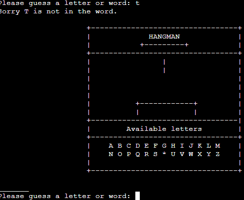

# Hangman

[You can access the live site here!](https://hawkman-8e541fe8aa41.herokuapp.com/)
 
 

## Table of Contents

1. [**Introduction**](#introduction)

2. [**User Experience(UX)**](#user-experience(ux))
     
3. [**Features**](features)
     
4. [**Technology Used**](#technology-used)
 
5. [**Testing**](#testing)

6. [**Deployment**](#deployment)
    
7. [**Credits**](#credits)

# Introduction

 
 

For my third portfolio project, I have chosen the popular and enjoyable game known as Hangman. I have implemented Hangman as a Python terminal game, which can be accessed through the Code Institute terminal on Heroku.

Upon launching the game, users will be greeted by a welcoming screen and presented with three options. The first option initiates the game, prompting the user to enter a username. After entering a username, the user will be shown an initial stage of the hangman image, which progressively changes with each incorrect guess. Additionally, a randomly selected word will be displayed with underscores representing each letter. As the user correctly guesses letters, they will be revealed in place of the underscores, until either the entire word is guessed correctly or the user exhausts their allotted guesses. When the user runs out of lives, the final stage of the hangman will be displayed, depicting a stickman hanging from a platform. At this point, the user will have the choice to play again or save their username and score to Google Sheets.

    
 

# User Experience(UX)

 
 

 - First Time User Goals. 
   1. As a First Time Visitor, I want to easily navigate through the game with simple inputs.
   2. As a First Time Visitor, I want to be able to have fun, enjoy the game and feel nostalgic when playing.
   3. As a First Time Visitor, I want to be able to attempt to be any Highscores.
   4. As a First Time Visitor, I want to be able to make sure I dont get any repeated words.
 
 - Returning Visitor Goals.
   1. As a Returning Visitor, I want to be able to check and see the updated Highscores and be able to try to beat any again.
   2. As a Returning Visitor, I want the navigation to be the same as it was the first time to keep it familiar.
   3. As a Returning Visitor, I want the be able to guess different words that I haven't guessed before.
   4. As a Returning Visitor, I want to be able to play with a friend to see who gets a higher score.
     
 - Frequent User Goals.
   1. As a Frequent User, I want to be able to notice different words still being guessed.
   2. As a Frequent User, I want the navigation to be the same throughout.

       
 

   # Feautures
   
    
 

   ## Home page

When you get to the main screen you will see the hangman symbol for the page and two options which ar,
   
Play: Dive right into the word-guessing adventure, where you'll uncover hidden words and race against the hangman's noose. Get ready for an exciting journey from start to finish!

Quit: Take a break or return to your daily activities. You can play Hangman at your own pace and come back whenever you want. The game will be waiting for you!
  

## Interactive Visuals

The visuals of Hangman add an element of suspense and intrigue to the game. Students will witness the hangman's fate hanging in the balance with every incorrect guess, creating a sense of excitement and responsibility for their choices.

## Letter Box

To aid in their word-guessing journey, students will find a letter box prominently displayed within the interface. This letter box shows the letters they have used so far, helping them strategize and make informed decisions about which letters to guess next. It encourages a thoughtful approach to word-solving and reinforces their understanding of letter patterns.

## Guessing a Right Answer:

When a correct letter is guessed in Hangman, the game responds with a rewarding animation. The letter elegantly fills the corresponding blank spaces in the secret word, bringing it one step closer to complete revelation. This positive feedback fosters a sense of accomplishment and motivates players to continue their pursuit of uncovering the hidden word.

## Guessing a Wrong Answer:

If a wrong letter is guessed, the hangman's gallows will gradually take form with each incorrect attempt. This visual feedback provides a gentle reminder of the consequence of the choice made, encouraging players to think carefully before making their next guess.

Throughout the game, the ticking off of letters and the progress of the hangman serve as visual cues, guiding players on their word-solving journey. The combination of positive reinforcement for right answers and the gentle reminder of consequences for wrong guesses ensures an enjoyable and educational experience for all players.

## Win game

When you successfully guess the entire secret word in Hangman, a victory message will appear on the screen, congratulating you on your triumph.

## Lose game

In Hangman, if you exhaust all your attempts without guessing the secret word, a defeat message will appear, acknowledging the game's conclusion.

## Option to play again

After completing the game, you will have the opportunity to play again by simply clicking on the "Play Again" button. Challenge yourself to improve your word-guessing skills and enjoy the excitement of Hangman's engaging gameplay as many times as you desire.

    
 

# Technology Used

 
 

## Languages Used
 - [Python](https://en.wikipedia.org/wiki/Python_(programming_language))
 
## Frameworks

- [Git](https://git-scm.com/)
    - Git was used for version control by utilizing the Gitpod terminal to commit to Git and Push to GitHub.
- [GitHub:](https://github.com/)
    - GitHub is used to store the projects code after being pushed from Git.
- [Heroku](https://www.heroku.com) 
    - Heroku is used to build, run and scale applications in a similar manner across most languages.

        
 

# Testing

## Validation
I am pleased to report that the Python code underwent a comprehensive validation process, and the results are highly favorable. Throughout the rigorous examination, no errors were detected, indicating the code's excellent quality and adherence to coding standards.

The validation process involved meticulous testing and verification of the code's functionality. It has successfully passed all required tests, ensuring its reliability and accuracy for its intended purpose.

## Bugs
During gameplay in the Hangman game, a notable bug has been identified. Upon correctly guessing a letter that exists in the secret word, the game fails to cross off the letter from the available options in the letter box. The expected behavior is for the guessed letter to be visually marked or crossed off, indicating it has been used, preventing players from repeating the same letter in subsequent guesses.

I then realized i made an error with the syntax and i quickly found a solution

    
 

# Deployment

 
 

## Heroku
To deploy this page to Heroku from its [GitHub repository](https://github.com/D0nie1998/hangman-dk/tree/main) the following steps were taken:

- Log into or register new account at [Heroku](https://www.heroku.com/).
- Click the button **New** in top right corner of the dashboard.
- From the drop-down menu select **Create new app**.
- Enter your apps name in the first field and select your region.
- Click on **Create App** if you are happy with your choices.
- Once you the app is made you will see yourself within **Deploy** tab. Press on **Settings** tab.
- Once you are in the **Settings** tab scroll down till you find **Config Vars**.
- Press the button **Reveal Config Vars** and for 'KEY' field, type in PORT and for the value field type in '8000'.
Press the **Add** button.
- Scroll down to **Buildpacks**. Click the button **Add buildpack** and select 'python'. Do the same step and add 'node.js'.
**PYTHON MUST BE ON TOP OF THE BUILDPACKS. IF IN YOUR CASE NODE.JS IS FIRST, CLICK AND DRAG PYTHON TO TOP AND SAVE.**
- Return back to the **Deploy** tab. From the deployment method, select 'Github' as the deployment.
- You will be asked to connect your github account. Confirm and proceed.
- Search for your repository name and connect.
- Once that is done and successfully connected, select how you want to push updates from the following options.

  _Clicking **Enable Automatic Deploys**. This will update once you push updates to your Github._

  _Selecting the correct branch for deployment from drop-down menu and pressing **Deploy Branch** button. This will have to be done everytime manually._
    
 

# Credits

 
 

## Content

I sourced the captivating visuals for Hangman from the website called Trinket. Trinket provides a wide array of interactive learning tools and resources, including graphics and illustrations that are ideal for educational game development. With Trinket's diverse collection of visual assets, I was able to create an engaging and visually appealing gaming experience for Hangman.

To develop the Hangman game, I drew inspiration and guidance from a comprehensive youtuber named Kite. The tutorial provided step-by-step instructions on coding the game mechanics, user interface, and interactive features. By following the tutorial, I gained the necessary knowledge and skills to bring the Hangman game to life, creating an engaging and entertaining word-guessing adventure for players to enjoy.

## Acknowledgements

## Family and friends
I want to take a moment to express my heartfelt gratitude for your unwavering support and love during these past few months. It has been a challenging time in my personal life, and your presence and kindness have made all the difference.

## Code Institute
I would like to extend my heartfelt gratitude to Code Institute for their exceptional support and understanding during a challenging period in my life. Your understanding and compassion have been invaluable during this time, and I am deeply grateful for the encouragement and assistance you provided.
